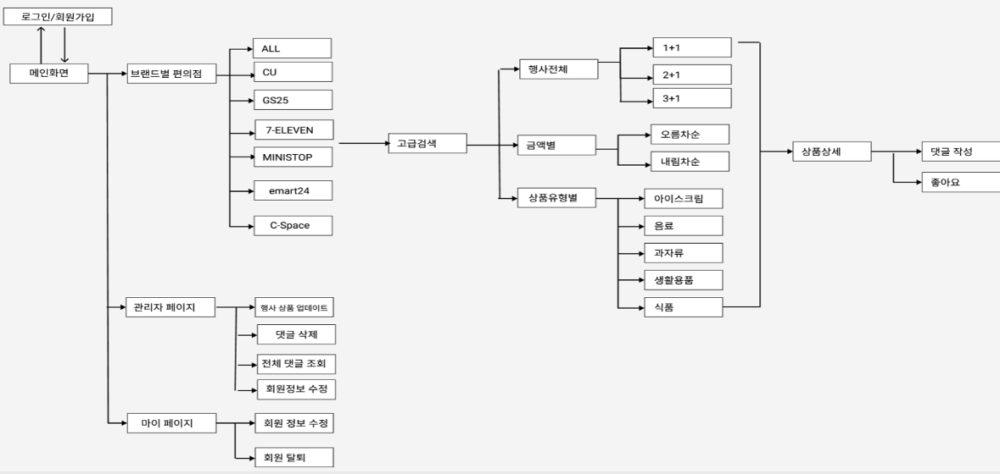

# pyeoni


## 프로젝트 소개
```
편의점마다 1+1, 2+1 과 같은 행사들을 회사, 제품, 이벤트로 분류하여 사용자가 한 눈에 행사상품을 찾을 수 있는 서비스
```
## 인프라

- Tomcat(WAS)
- Servlet/JSP
- Oracle11g
- jQuery

## 디자인 패턴 및 담당업무

- 벡엔드를 맡았으며 JSP와 Servlet을 사용하는 MVC 패턴에서 코드의 복잡성 떄문에 코드의 단순화의 필요성을 느낌.
- 공통 기능을 중앙 집중식으로 처리하기 위해 Front Controller(MVC2) 디자인 패턴을 사용.
- FrontController 역할을 수행하는 DispatcherServlet(`FrontController`)이 클라이언트의 요청을 받고 HandlerMapping(`CommonControllerInterface`)을 통해 Controller와 매핑되어 해당 컨트롤러를 실행.

## Workflow



## Table structure


